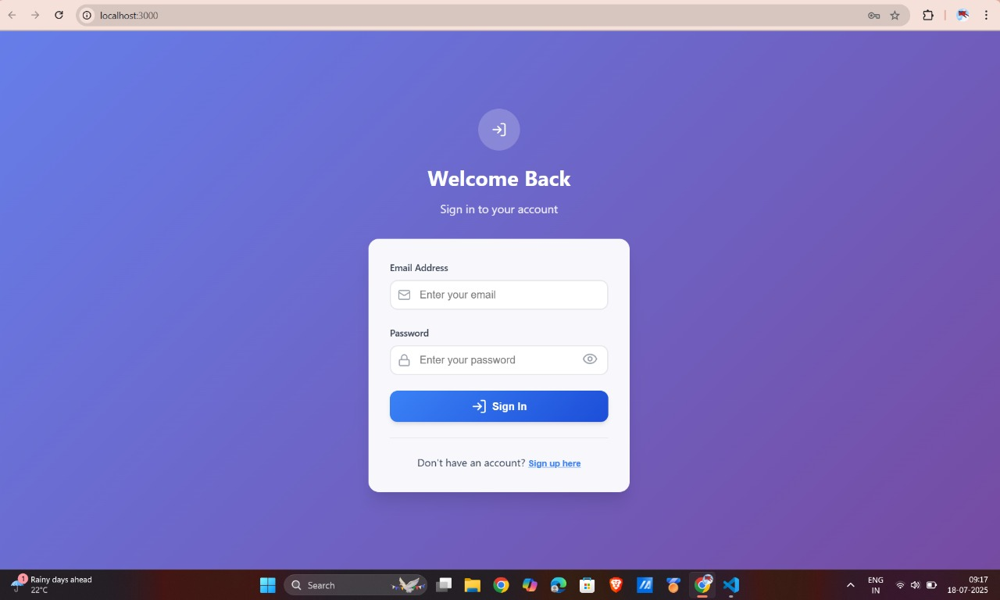
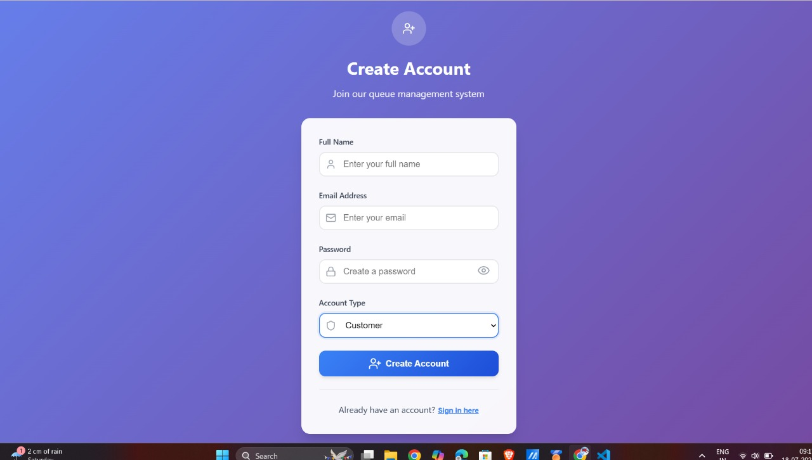
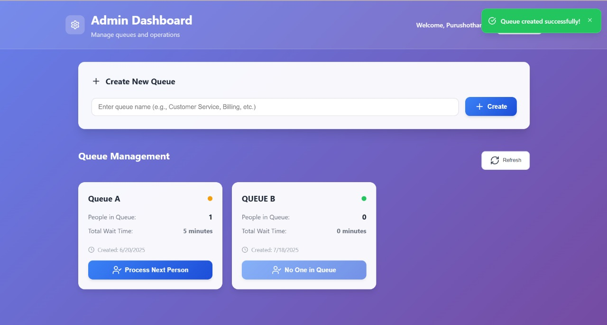

# 🏥 Smart Queue Management System

<div align="center">
  
  
  [](https://reactjs.org/)
  [](https://nodejs.org/)
  [](https://expressjs.com/)
  [](https://sqlite.org/)
  [](LICENSE)
</div>

---

## 🌟 Overview

A **modern, responsive web-based queue management system** designed to revolutionize customer service efficiency in clinics, banks, government offices, and public service centers. Built with cutting-edge technologies and featuring a beautiful, intuitive user interface.

### ✨ Key Highlights

- 🎯 **Real-time Queue Tracking** - Live updates every 3-5 seconds
- 🔐 **Secure Authentication** - bcrypt password hashing
- 📱 **Responsive Design** - Works perfectly on all devices
- ⚡ **Lightning Fast** - Built with Vite for optimal performance
- 🎨 **Modern UI/UX** - Custom CSS and animations
- 🔄 **Auto-refresh** - Real-time data synchronization

---

## 🚀 Features

### 👥 **User Management**
- ✅ **Dual Role System** - Customer & Admin accounts
- ✅ **Secure Registration & Login** - Email validation & password encryption
- ✅ **Profile Management** - User-specific dashboards

### 🎫 **Queue Operations**
- ✅ **Smart Token Generation** - Automatic position assignment
- ✅ **Real-time Position Tracking** - Live queue updates
- ✅ **Intelligent Wait Time Estimation** - Dynamic calculations
- ✅ **One-click Join/Leave** - Seamless queue management

### 🧑‍💼 **Admin Controls**
- ✅ **Queue Creation & Management** - Unlimited queue support
- ✅ **Process Next Customer** - Efficient queue processing
- ✅ **Live Dashboard** - Real-time monitoring
- ✅ **Analytics Overview** - Queue length & wait times

### 🎨 **User Experience**
- ✅ **Toast Notifications** - Real-time feedback
- ✅ **Loading States** - Professional loading indicators
- ✅ **Error Handling** - Graceful error management

---

## 🛠️ Tech Stack

### Frontend
| Technology | Version | Purpose |
|------------|---------|---------|
| ⚛️ **React.js** | 18.3.1 | UI Framework |
| ⚡ **Vite** | 5.4.19 | Build Tool |
| 🔗 **Axios** | Latest | HTTP Client |
| 🎯 **Lucide React** | Latest | Icons |
| 🎨 **CSS3** | Latest | Styling |

### Backend
| Technology | Version | Purpose |
|------------|---------|---------|
| 🌐 **Node.js** | Latest | Runtime |
| 🚀 **Express.js** | 4.21.2 | Web Framework |
| 🗂️ **SQLite3** | 5.1.7 | Database |
| 🔐 **bcrypt** | 5.1.1 | Password Hashing |
| 🌍 **CORS** | 2.8.5 | Cross-Origin Support |

---

## 📁 Project Architecture

```
smart-queue-management/
├── 📂 backend/
│   ├── server.js
│   ├── package.json
│   └── queue_system.db
│
├── 📂 src/
│   ├── 📂 components/
│   │   ├── 📂 ui/
│   │   │   ├── LoadingSpinner.jsx
│   │   │   └── Toast.jsx
│   │   ├── Login.jsx
│   │   ├── Register.jsx
│   │   ├── Dashboard.jsx
│   │   └── AdminDashboard.jsx
│   ├── 📂 services/
│   │   └── api.js
│   ├── App.jsx
│   ├── main.jsx
│   └── index.css
│
├── 📂 assets/
│   └── 📂 screenshots/
│       ├── login.jpg
│       ├── register.jpg
│       ├── customer_dashboard.jpg
│       └── admin_dashboard.jpg
│
├── package.json
├── vite.config.js
└── README.md
```

---

## 📸 Screenshots

### 🔐 Authentication Page


### 📝 Registration Page


### 👥 Customer Queue Dashboard


### 🧑‍💼 Admin Queue Dashboard


---

## ⚙️ Quick Start

### 🔧 Prerequisites

- Node.js (v16+)
- npm or yarn
- Git

### 🚀 Installation

```bash
git clone https://github.com/purushotham2628/smart-queue-management.git
cd smart-queue-management
npm run install:all
npm run dev
```

### Access URLs
- Frontend: http://localhost:3000
- Backend: http://localhost:3001

---

## 🔌 API Endpoints

### Authentication
| Method | Endpoint | Description |
|--------|----------|-------------|
| `POST` | `/api/register` | User registration |
| `POST` | `/api/login` | User authentication |

### Queue Management
| Method | Endpoint | Description |
|--------|----------|-------------|
| `GET` | `/api/queues` | Get all queues |
| `POST` | `/api/queues` | Create new queue |
| `POST` | `/api/join-queue` | Join a queue |
| `DELETE` | `/api/leave-queue/:userId` | Leave queue |
| `GET` | `/api/user-queue/:userId` | Get user's queue status |
| `POST` | `/api/process-next/:queueId` | Process next in queue |

---

## 📄 License

This project is licensed under the **MIT License** - see the [LICENSE](LICENSE) file.

---

## 👨‍💻 Author

**Purushotham E**  
[GitHub](https://github.com/purushotham2628) ・ [LinkedIn](https://linkedin.com/in/purushotham2628) ・ [Email](mailto:purushotham2628@gmail.com)

---

### ⭐ Star this repo if you like it!

**Made with ❤️ by [Purushotham E](https://github.com/purushotham2628)**
